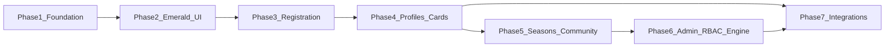

# BPCL Season 2 — Phased Implementation Plan

**How to use this doc:** Build **one phase at a time**. Do not start the next phase until that phase’s **exit criteria** are met. Each phase maps to your requirements (numbered R1–R9 below).

**Related docs:** [season2plan.md](season2plan.md) (vision), [app-summary.md](app-summary.md) (current system), Cursor plan `season_2_revamp_plan_3739bff1.plan.md`.

**Git branch:** All Season 2 implementation happens on **`season2`** (branched from `main`). Merge to `main` after each phase is tested or at season launch.

```bash
git checkout season2    # daily work
git checkout main       # production hotfixes only
```

---

## Requirements traceability

| ID | Your requirement | Primary phase(s) |
|----|------------------|------------------|
| R1 | Light theme + emerald accents; preserve logo colors on contrast sections | Phase 2 |
| R2 | Full-auto registration: account, email/Google, Steam+Discord OAuth, profile register, substitute pool | Phase 1 + 3 |
| R3 | Account tracks drafted team + match schedule vs opponents | Phase 4 |
| R4 | BPC coins redeem at checkout (admin-granted only) | Phase 3 |
| R5 | Public player profiles + BPC player cards (digital tiers) | Phase 4 + 5 |
| R6 | Public site: profiles, community, announcements, seasons (past + current) | Phase 2 + 5 |
| R7 | Admin: tighter routes, flexible schedule/brackets, tournament engine | Phase 6 |
| R8 | RBAC for delegated admins | Phase 6 |
| R9 | Card bundle at registration checkout; cards visible sitewide | Phase 3 + 5 |
| R10 | Season pages: winners, MVP, standings; homepage trophy + Aegis-style engraving | Phase 5 |
| — | Discord card roles + GSI overlay card API | Phase 7 |
| — | S1 BPC-### IDs, phone, email, Discord, Steam preserved | Phase 1 migration |

### Card pricing (locked for implementation)

| Tier | Standalone | Bundled with ₹300 reg | Example total |
|------|------------|------------------------|---------------|
| Default grey | Included in reg | — | ₹300 |
| Player (dark + stats) | ₹300 | ₹240 (20%) | ₹540 |
| Gold (custom logo, stats, Discord perks TBD) | ₹450 | ₹360 (20%) | ₹660 |
| Holo (custom avatar, tagline, role, perks TBD) | ₹700 | ₹595 (15%) | ₹895 |

Payment gateway: **abstract in Phase 3**; Razorpay when business KYC ready; manual provider until then.

---

## Phase overview (build order)



| Phase | Name | Est. focus | Blocks |
|-------|------|------------|--------|
| **1** | Platform foundation | DB, accounts, OAuth, S1 migration | Everything |
| **2** | Emerald UI + site shell | Theme, nav, light public pages | Phase 3 UX |
| **3** | Registration & commerce | Checkout, coins, substitutes | Season 2 reg open |
| **4** | Player identity | Cards, profiles, dashboard team/matches | Marketing cards |
| **5** | Seasons & community | Season hub, trophy, match pages, card placement | S2 marketing |
| **6** | Admin ops & engine | RBAC, builder, schedule UX | Delegation |
| **7** | Integrations | Discord, GSI overlay API | Stream/discord polish |

---

# Phase 1 — Platform foundation

**Goal:** Permanent BPCL accounts with global `BPC-###`, auth, Steam/Discord OAuth, and Season 1 data migration. No visual revamp yet beyond minimal auth pages.

**Satisfies:** R2 (foundation), R10 (S1 IDs), partial R3.

### Prerequisites

- PostgreSQL backups of production/staging before migration.
- Steam Web API key + Discord application created (redirect URLs for dev + prod).
- Google OAuth client for login.

### 1.1 Database (migrations `025`–`028`)

**New tables**

- `player_accounts` — canonical identity  
  - `bpc_id` TEXT UNIQUE NOT NULL (global, e.g. `BPC-042`)  
  - `email` UNIQUE, `password_hash` nullable, `google_sub` nullable  
  - `email_verified_at`, `phone`, `display_name`, `slug` UNIQUE  
  - `steam_id`, `steam_persona`, `steam_avatar_url`, `steam_profile`  
  - `discord_id`, `discord_username`, `discord_avatar_url`  
  - `avatar_url`, `bio`, `global_registration_seq` helper or separate `bpc_id_seq` table  
  - timestamps  

- `player_sessions` — Bearer tokens (mirror `admin_sessions` pattern)

- `player_account_links` — audit trail for OAuth link/unlink

- `bpc_coin_ledger` — `player_account_id`, `delta`, `balance_after`, `reason`, `granted_by_admin_id`, `tournament_id` nullable

- `seasons` — scaffold only in Phase 1 (`slug`, `number`, `status`, `tournament_id` nullable)

**Alter**

- `player_registrations`: add `player_account_id` FK, `card_tier`, `checkout_order_id`, `substitute_flag`, `payment_provider`, `payment_ref`, `auto_approved_at` (columns used in later phases; nullable now)

- `players` / `roster_snapshot_players`: add `player_account_id` nullable (backfill in Phase 4)

**Global BPC ID rule**

- New IDs from `bpc_id_seq` — **never** per-tournament `registration_code_seq` for display ID again.
- Migration assigns existing S1 codes; seq continues from max(S1).

### 1.2 Season 1 migration script

`server/scripts/migrate-s1-to-player-accounts.js`

1. Select all non-archived `player_registrations` ordered by `email_verified_at`, `created_at`.
2. Group by `lower(email)` → one `player_accounts` row.
3. `bpc_id` = minimum `public_code` per email (preserve `BPC-001` ordering).
4. Copy: phone (if column exists), email, verified time, Discord, Steam fields, display name.
5. Generate `slug` from display name (dedupe with suffix).
6. Set `player_registrations.player_account_id` for all rows in group.
7. Report: duplicates skipped, accounts created, max BPC number for seq init.
8. **Dry-run mode** + confirmation prompt in production.

### 1.3 Backend — player auth

**New files**

- `server/src/routes/player.js` — mount at `/api/player`
- `server/src/services/playerAuthService.js`
- `server/src/services/playerAccountRepository.js`
- `server/src/services/steamOpenIdService.js`
- `server/src/services/discordOAuthService.js`

**Endpoints**

| Method | Path | Purpose |
|--------|------|---------|
| POST | `/api/player/auth/register` | Email + password signup → send verification email |
| POST | `/api/player/auth/login` | Email login → session token |
| POST | `/api/player/auth/google` | Google ID token exchange → account create/link |
| GET | `/api/player/auth/verify-email` | Token from email link |
| POST | `/api/player/auth/logout` | Invalidate session |
| GET | `/api/player/me` | Profile + eligibility flags |
| PATCH | `/api/player/me` | display_name, phone, bio, slug change (restricted) |
| GET | `/api/player/auth/steam/start` | Redirect to Steam OpenID |
| GET | `/api/player/auth/steam/callback` | Link steam_id to account |
| GET | `/api/player/auth/discord/start` | OAuth authorize |
| GET | `/api/player/auth/discord/callback` | Link discord_id |

**Eligibility object on `/me`**

```json
{
  "emailVerified": true,
  "steamLinked": true,
  "discordLinked": true,
  "eligibleForRegistration": true,
  "bpcId": "BPC-042"
}
```

**Middleware:** `requirePlayer` — same pattern as `requireAdmin`.

### 1.4 Frontend — routing foundation

- Add `react-router-dom`.
- Split [App.jsx](dota/src/App.jsx): public routes vs `/admin` unchanged tab shell.
- New pages (minimal styling, functional only):
  - `/login`, `/signup`, `/verify-email`
  - `/dashboard` — eligibility checklist + links to link Steam/Discord
  - `/player/:slug` — placeholder (“Profile coming in Phase 4”)
- Token: `localStorage` key `bpcl-player-token` (parallel to admin token).
- [api.js](dota/src/lib/api.js) — `playerApi` section.

### 1.5 Admin (minimal)

- Registration CRM: show `player_account_id`, `bpc_id`, link to future profile slug (read-only).
- No RBAC changes yet.

### 1.6 Testing & exit criteria

**Test checklist**

- [ ] S1 migrated player logs in with email (set password via “forgot password” or invite email flow).
- [ ] Google login creates account; duplicate email handled gracefully.
- [ ] Steam + Discord link updates `/me` eligibility.
- [ ] Two registrations same email → one account, two `player_registrations` rows linked.
- [ ] New account gets next global `BPC-###` without collision.
- [ ] Old `/register` OTP still works OR banner “Create account first” (your choice: **recommend** keep OTP read-only until Phase 3 cutover).

**Exit criteria (do not start Phase 2 until all pass)**

1. Migration dry-run reviewed; production migration executed.
2. ≥1 real S1 player can log in and see correct `BPC-###`.
3. OAuth callbacks work on staging domain.

**Out of scope for Phase 1**

- Checkout, cards, theme revamp, seasons content, RBAC, tournament builder.

---

# Phase 2 — Emerald UI + public site shell

**Goal:** Season 2 visual identity on all existing public pages; improved information architecture (nav stubs); preserve amber/gold brand bands.

**Satisfies:** R1, partial R6 (nav structure).

### Prerequisites

- Phase 1 complete (Login/Dashboard links in nav).

### 2.1 Design tokens

**Files**

- [dota/src/index.css](dota/src/index.css) — add `:root[data-season="emerald"]` overrides
- `dota/src/styles/season-emerald.css` — rune patterns, jade gradients

**Token map**

| Token | Light + emerald | Contrast sections (logo) |
|-------|-----------------|---------------------------|
| `--background` | `#f8fafc` | — |
| `--season-accent` | `#059669` / jade | — |
| `--primary` | emerald for links/CTAs | keep `#b45309` amber on hero/footer/trophy |
| `--card` | white + subtle border | dark band `#0f172a` or existing dark hero |

**App.jsx change:** Remove forced `document.documentElement.classList.add('dark')` on public routes; default light.

### 2.2 Page refactors (existing routes)

Apply light theme + emerald accents to:

| Route | File(s) |
|-------|---------|
| `/` | [landing-hero.css](dota/src/styles/landing-hero.css), [LandingLeagueOverview.jsx](dota/src/components/LandingLeagueOverview.jsx) |
| `/tournament` | [tournament-page.css](dota/src/styles/tournament-page.css) |
| `/schedule` | [schedule-page.css](dota/src/styles/schedule-page.css) — keep stream embed behavior |
| `/teams` | [teams-page.css](dota/src/styles/teams-page.css) |
| `/rules`, `/privacy`, `/cookies` | shared legal styles |

**Do not break:** bracket diagrams, team logos, live YouTube embed on schedule.

### 2.3 Navigation & IA stubs

Update [SiteNavbar](dota/src/components/) (or equivalent):

| Nav item | Route | Phase 2 behavior |
|----------|-------|------------------|
| Home | `/` | Live |
| Tournament | `/tournament` | Live |
| Bracket & Schedule | `/schedule` | Live |
| Teams | `/teams` | Live |
| Seasons | `/seasons` | Stub page: “Season hub — Phase 5” |
| News | `/announcements` | Stub or basic list from tournament payload |
| Community | `/community` | Stub |
| Login / Dashboard | auth routes | Live from Phase 1 |
| Register | `/dashboard` (when logged in) | Redirect; CTA “Register” → login if anonymous |

### 2.4 Auth pages polish

- Match emerald theme; clear steps: Sign up → Verify → Link Steam → Link Discord.

### 2.5 Testing & exit criteria

- [ ] WCAG AA contrast on body text and primary buttons (spot-check).
- [ ] Schedule/bracket readable on light background.
- [ ] Hero/footer still show BPCL amber branding clearly.
- [ ] Mobile nav works with new items.

**Exit criteria**

1. Public site default is **light + emerald**; admin toggle unchanged.
2. All pre-existing public features (schedule, streams, teams) work unchanged.

**Out of scope**

- Checkout, full seasons data, card components, profile content.

---

# Phase 3 — Registration & commerce

**Goal:** Replace semi-manual OTP+screenshot with dashboard checkout: reg fee + card bundle + BPC coins; substitute pool when reg closed.

**Satisfies:** R2, R4, R9 (checkout bundle).

### Prerequisites

- Phases 1–2 complete.
- Tournament row for Season 2 created in admin (draft OK for staging).

### 3.1 Payment abstraction

**New**

- `server/src/services/paymentService.js`
- `checkout_orders` table: `id`, `player_account_id`, `tournament_id`, `line_items` JSONB, `subtotal`, `coin_discount`, `total`, `provider` (`manual`|`razorpay`), `status`, `provider_ref`, timestamps
- `payment_webhooks` log table (future Razorpay)

**Providers**

| Provider | Behavior |
|----------|----------|
| `manual` | Order `pending_payment` → show UPI QR from tournament + “I’ve paid” optional; admin/auto mark paid (webhook simulation button in dev) |
| `razorpay` | Stub adapter interface; implement when KYC ready |

**On paid**

- Create/update `player_registrations`: `payment_status=paid`, `registration_status=approved`, `auto_approved_at=NOW()`, `card_tier`, link `checkout_order_id`.
- Deduct coins in same DB transaction.
- Idempotent webhook handler.

### 3.2 Checkout API

| Method | Path | Purpose |
|--------|------|---------|
| POST | `/api/player/tournaments/:slug/checkout/preview` | Line items + coin discount + total |
| POST | `/api/player/tournaments/:slug/checkout/confirm` | Create order + return payment instructions |
| POST | `/api/player/tournaments/:slug/checkout/complete` | Manual mark paid (dev) or webhook |

**Preview logic**

```javascript
lineItems = [
  { key: 'registration', amount: 300 },
  { key: 'card_player', amount: bundled ? 240 : 300, optional },
  // gold, holo idem
]
coinDiscount = min(balance, policyMax) // policy: e.g. cannot reduce reg below ₹X
total = sum(lineItems) - coinDiscount
```

Default tier: `card_tier = 'default'` (grey included, no extra line item).

### 3.3 BPC coins (admin grant)

| Method | Path | Auth |
|--------|------|------|
| POST | `/api/admin/player-accounts/:id/coins` | superadmin (RBAC in Phase 6) |
| GET | `/api/player/me/coins` | player — balance + recent ledger |

### 3.4 Substitute pool

| Method | Path | When |
|--------|------|------|
| POST | `/api/player/tournaments/:slug/substitute` | `registrations_open = false` |

Fields: roles, mmr, availability, notes → `substitute_flag=true`, no payment.

Admin CRM filter: “Substitutes only”.

### 3.5 Frontend — dashboard registration

**`/dashboard` sections**

1. Eligibility (from Phase 1)
2. **Register for [Tournament]** — visible if `registrations_open` + eligible
3. Checkout wizard:
   - Step 1: Card tier selector (grey default / player / gold / holo) with live price table
   - Step 2: Apply BPC coins (slider or input, max shown)
   - Step 3: Payment (QR + status polling or Razorpay embed)
   - Step 4: Confirmation + BPC ID + tier purchased
4. **Substitute signup** — when reg closed

### 3.6 Cutover from legacy `/register`

- `/register` → redirect to `/login?next=/dashboard` with message.
- Keep `GET` session endpoints for S1 incomplete payments (optional grace period).
- Public slug: resolve from published tournament, not hardcoded `bpcl` in [PublicPages.jsx](dota/src/pages/PublicPages.jsx).

### 3.7 Gold/Holo assets at checkout

- Gold: upload custom logo (pending approval — queue in Phase 4; allow upload with `pending_approval` state)
- Holo: upload avatar + tagline field

Store in `player_card_assets` table: `player_account_id`, `tier`, `asset_url`, `tagline`, `status`.

### 3.8 Testing & exit criteria

- [ ] Reg-only ₹300 completes and appears in CRM as paid+approved.
- [ ] Reg + Player = ₹540; coins reduce total correctly; ledger updated.
- [ ] Ineligible (no Discord) blocked with clear message.
- [ ] Substitute registers without payment when reg closed.
- [ ] Returning S1 email links to existing `bpc_id`, new registration row for S2 tournament.

**Exit criteria**

1. End-to-end registration without admin screenshot approval (manual payment provider OK).
2. Card tier persisted on registration row.

**Out of scope**

- Full profile page, card render on schedule, RBAC, seasons pages.

---

# Phase 4 — Player cards & identity layer

**Goal:** Digital card system, public profiles, dashboard with team + match schedule.

**Satisfies:** R3, R5, partial R9 (card preview after purchase).

### Prerequisites

- Phase 3 registrations exist (test accounts with each tier).

### 4.1 Card schema & renderer

**`card_manifest` JSON (API contract for web + Discord + GSI)**

```json
{
  "tier": "player",
  "bpcId": "BPC-042",
  "displayName": "AddicTzZ",
  "seasonBadge": "S2 Emerald",
  "stats": { "mmr": 4500, "role": "Mid" },
  "steamAvatar": "https://...",
  "customImage": null,
  "tagline": null,
  "frameTheme": "emerald"
}
```

**Implementation**

- `server/src/services/cardManifestService.js` — build from account + registration + season
- `dota/src/components/cards/BpclCard.jsx` — tiers: `default | player | gold | holo`
- `dota/src/components/cards/CardTierStyles.css`
- Optional: `GET /api/public/cards/:slug.png` via sharp (Phase 7 for overlay)

### 4.2 Public profile `/player/:slug`

| Section | Data source |
|---------|-------------|
| Hero card | card manifest |
| Current team | approved roster → `player_account_id` match |
| Career stats | aggregate matches (basic: from honors + registration count in S2; expand later) |
| Season history | `season_participations` (Phase 5 backfill) |
| Team history | past roster snapshots |
| Clips | JSON array on account or season (admin-editable initially) |
| Achievements | badges array (champion, MVP, founding) |

**API:** `GET /api/public/players/:slug`

### 4.3 Dashboard enhancements

| Section | Logic |
|---------|--------|
| My card | Render manifest; show pending approval for gold/holo assets |
| My team | Query approved `roster_snapshot_players` for active tournament |
| My matches | Join team name → `matches` where team1/team2 + `schedule_slots` |
| My registrations | List by tournament/season |
| BPC coins | Balance (read-only) |

**API:** `GET /api/player/team`, `GET /api/player/matches`

**Roster linkage:** Backfill `player_account_id` on `players` / snapshot players via `registration_id` → `player_registrations.player_account_id`.

### 4.4 Admin — card approvals

- Tab or section under Registrations: pending gold/holo assets → approve/reject.
- Phase 6 moves to `card_manager` role.

### 4.5 Testing & exit criteria

- [ ] Each tier renders correctly (grey no stats, dark with stats, gold custom logo, holo tagline).
- [ ] Public profile accessible without login.
- [ ] Drafted player sees opponent + datetime on dashboard when schedule exists.
- [ ] Player not on roster sees empty team state gracefully.

**Exit criteria**

1. Cards represent purchased tier accurately.
2. Dashboard “My matches” matches public schedule data.

**Out of scope**

- Homepage carousel, season pages, Discord bot.

---

# Phase 5 — Seasons, community & card visibility

**Goal:** Season hub, S1 archive, trophy showcase, match pages, cards across the public site.

**Satisfies:** R6, R10, R9 (visibility), enhances stream experience.

### Prerequisites

- Phase 4 cards + profiles.
- S1 tournament data available (honors, bracket, standings).

### 5.1 Seasons data

**Populate `seasons`**

| slug | status | tournament_id |
|------|--------|---------------|
| `season-1` | `concluded` | S1 tournament UUID |
| `season-2-emerald` | `active` or `upcoming` | S2 tournament UUID |

**`season_participations`** — backfill S1 from approved roster + honors (MVP, placement).

**`trophy_engraving` JSONB** on S1 season:

```json
{
  "teamName": "Champions",
  "players": ["Player1", "Player2"],
  "mvp": "Name",
  "seasonLabel": "BPCL Season 1"
}
```

### 5.2 Public routes

| Route | Content |
|-------|---------|
| `/seasons` | Grid cards per season (theme color, status, champion teaser) |
| `/seasons/season-1` | Theme, champion, runner-up, MVP, standings, teams, honors, highlights embeds |
| `/seasons/season-2-emerald` | Active season info + registration CTA |
| `/announcements` | Paginated `announcements` + categories filter |
| `/community` | Player directory (cards as grid), search by name/slug |
| `/match/:matchId` | Teams, logos, series type, schedule, stream embed if live, roster cards |

### 5.3 Homepage blocks

- **Defending champions** — S1 winner logo, names, link to season page.
- **3D trophy** — embed GLB/model-viewer; engraving from `trophy_engraving`.
- **Featured players** — carousel of holo/gold cards (admin-curated list in JSON config).

### 5.4 Card visibility (sitewide)

| Surface | Implementation |
|---------|----------------|
| `/teams` | Replace/supplement roster rows with `BpclCard` mini variant |
| `/schedule` | Captain cards under each matchup row |
| `/match/:id` | Full roster cards below stream |
| Homepage | Featured carousel |
| `/seasons/:slug` | Champion roster cards |

### 5.5 Announcements upgrade

- Categories: `registration`, `match_day`, `general`
- Optional `pinned` flag in tournament JSON schema
- Banner rotation unchanged on landing

### 5.6 Multi-publish strategy (S1 archive while S2 live)

**Option A (recommended):** Season pages read **historical snapshot** JSON for concluded seasons (export S1 `published_snapshot` into `seasons.snapshot` JSONB) — no second published tournament needed.

**Option B:** Relax single-publish rule — higher risk for public cache.

Implement **Option A** in this phase.

### 5.7 Testing & exit criteria

- [ ] `/seasons/season-1` shows correct winner/MVP/standings from S1 data.
- [ ] Trophy renders on homepage with engraved names.
- [ ] Schedule page shows captain cards; match page shows stream + cards.
- [ ] Community directory lists migrated players.

**Exit criteria**

1. New visitor understands league history and Season 2 theme.
2. Cards appear on ≥4 distinct public surfaces.

**Out of scope**

- RBAC, tournament builder, Discord automation.

---

# Phase 6 — Admin RBAC & tournament engine

**Goal:** Delegate admin work safely; flexible format presets; tighter destructive actions; better schedule ops.

**Satisfies:** R7, R8.

### Prerequisites

- Phases 1–5 live on staging.
- Identify real operators and assign roles.

### 6.1 RBAC model

**Migration**

- `admin_permissions` enum or reference table
- `admin_users.permissions` JSONB array **or** role template table

**Permission keys (minimum)**

```
tournament.create, tournament.delete, tournament.publish,
bracket.generate, bracket.result, schedule.edit,
registrations.view, registrations.edit, registrations.approve,
coins.grant, seasons.edit, news.edit, honors.edit,
cards.approve, users.manage
```

**Middleware:** `requirePermission('bracket.result')` on [tournaments.js](server/src/routes/tournaments.js) routes.

**UI:** [AdminUsersPage.jsx](dota/src/pages/AdminUsersPage.jsx) — assign role template or checkboxes; hide tabs in [AppHeader.jsx](dota/src/components/AppHeader.jsx).

**Role templates**

| Template | Permissions |
|----------|-------------|
| superadmin | `*` |
| tournament_admin | bracket.*, schedule.edit, honors.view |
| registration_manager | registrations.*, coins.grant |
| media_manager | news.edit, seasons.edit, honors.edit |
| card_manager | cards.approve |
| community_manager | registrations.view (read), future reports |

### 6.2 Tournament engine — format presets

**UI wizard on Setup tab**

1. Choose preset: `BLAST-12` (default), `BLAST-10`, `SE-8`, `RR-6`, custom (advanced)
2. Inputs: `team_count`, `group_count`, series rules map
3. Preview: stage list + match count
4. `POST .../generate` unchanged but preset → generator params

**Backend**

- `server/src/services/formatPresets.js` — maps preset id → `formatGenerator` call
- Do **not** delete existing BLAST logic; wrap it.

### 6.3 Admin UX hardening

- Confirm modal on: delete tournament, publish, generate bracket (destructive regen)
- Display tournament UUID + slug prominently; copy button
- Schedule: bulk edit stream URLs; optional conflict detection (same time, same stream)
- `audit_log` table: admin_id, action, entity, payload, timestamp

### 6.4 CRM integration

- Link every registration to `player_account` with profile link
- Coin grant button on account
- Substitute filter + export

### 6.5 Testing & exit criteria

- [ ] Non-superadmin with `registration_manager` cannot publish tournament.
- [ ] `tournament_admin` can enter match results but not delete tournament.
- [ ] BLAST-12 preset generates identical bracket to pre-preset behavior (regression test).
- [ ] Audit log records publish + bracket generate.

**Exit criteria**

1. You can hand off registration + bracket to two different people without sharing password.
2. New format preset can be selected without code deploy (within defined presets).

**Out of scope**

- Full custom bracket DSL, fantasy league.

---

# Phase 7 — Integrations & polish

**Goal:** Discord roles, GSI overlay API, shareable embeds, optional engagement features.

**Satisfies:** Discord/card privileges, broadcast overlay, extra Season 2 experience.

### Prerequisites

- Phase 4 card manifest stable.
- Discord bot token + server ID; bot invited with role hierarchy below card roles.

### 7.1 Public card API for GSI overlay

**Document:** `docs/overlay-api.md`

| Endpoint | Purpose |
|----------|---------|
| `GET /api/public/players/:slug/card` | JSON manifest |
| `GET /api/public/players/:slug/card.png` | Rendered PNG |
| `GET /api/public/matches/:id/roster-cards` | Both teams for match intro |

Coordinate with existing WebSocket GSI app (external).

### 7.2 Discord bot

- On registration `card_tier` set/confirmed → assign roles: `BPC-Player`, `BPC-Gold`, `BPC-Holo`
- Command `/card <slug>` → embed image + link to profile
- Showcase channel: auto-post on holo approval (optional)
- Boost perks: document in Discord server rules (manual config)

### 7.3 Engagement (pick what fits time)

| Feature | Priority |
|---------|----------|
| OG image per profile (card PNG) | High |
| Dashboard “Your match is LIVE” banner | High |
| Email match reminder 24h before | Medium |
| Hall of Fame page (slim) | Medium |
| MVP community vote | Low → Season 2.5 |
| Fantasy / predictions | Defer |

### 7.4 Razorpay go-live (when legal ready)

- Implement `razorpay` provider in `paymentService.js`
- Webhook URL + signature verification
- Switch tournament `payment_provider` field in Setup

### 7.5 Testing & exit criteria

- [ ] Overlay app consumes card PNG in draft/break segment test.
- [ ] Discord role updates within 60s of tier approval.
- [ ] Profile link unfurls with OG image.

**Exit criteria**

1. Stream overlay shows player cards without manual asset uploads.
2. Discord distinguishes card tiers visually.

---

# Cross-phase dependency matrix

| Need | Depends on |
|------|------------|
| Register with card bundle | Phase 1 account + Phase 3 checkout |
| Profile with card | Phase 3 tier + Phase 4 renderer |
| My matches on dashboard | Phase 1 account + Phase 4 roster link + schedule data |
| Season page champions | Phase 5 backfill + existing honors engine |
| Captain cards on schedule | Phase 4 card component + Phase 5 placement |
| Coin discount | Phase 1 ledger table + Phase 3 checkout |
| Substitute pool | Phase 1 account + Phase 3 endpoint |
| RBAC coin grant | Phase 3 coins + Phase 6 permissions |
| Discord roles | Phase 3 tier + Phase 7 bot |

---

# Suggested build calendar (one phase at a time)

| Order | Phase | You ship when… |
|-------|-------|----------------|
| 1 | Foundation | Players can log in and link accounts |
| 2 | Emerald UI | Site looks Season 2 on all current pages |
| 3 | Registration | Season 2 registration opens via dashboard |
| 4 | Cards & profiles | Identity layer is marketable |
| 5 | Seasons & visibility | History + trophy + cards everywhere |
| 6 | Admin & engine | Team can operate without you |
| 7 | Integrations | Stream + Discord complete the ecosystem |

---

# Phase-by-phase “definition of done” summary

| Phase | One sentence done |
|-------|-------------------|
| 1 | Every S1 player has one global account and BPC ID; OAuth works. |
| 2 | Public site is emerald light theme with expanded nav. |
| 3 | Registration + optional card + coins + substitutes work without CRM screenshots. |
| 4 | Profiles and dashboard show card, team, and matches. |
| 5 | Seasons, trophy, and cards appear across the marketing site. |
| 6 | Admins are scoped; tournament presets are selectable. |
| 7 | Discord and overlay consume the same card API. |

---

# When you are ready to execute

Reply with **“Start Phase 1”** (or specify a different starting phase if Phase 2 theme should run parallel). Implementation will follow this document only — no cross-phase scope unless you explicitly approve.

**Branch:** Work on `season2`; push with `git push -u origin season2` when ready to back up or open a PR.
